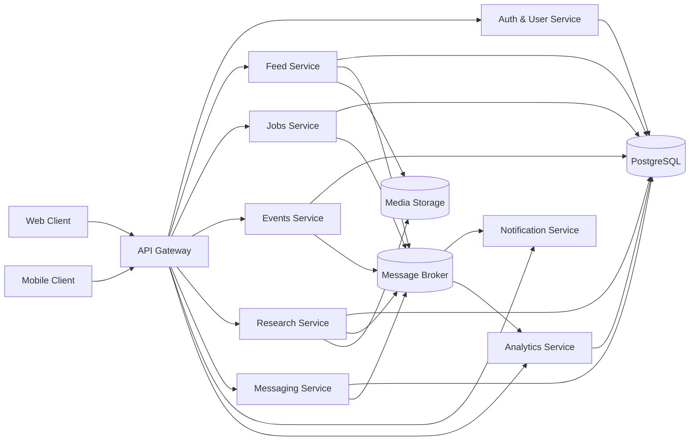
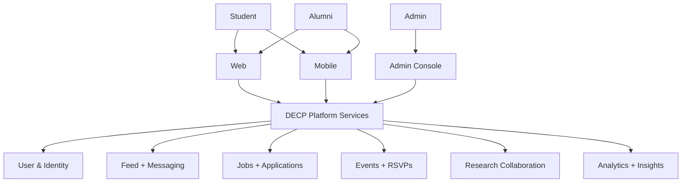
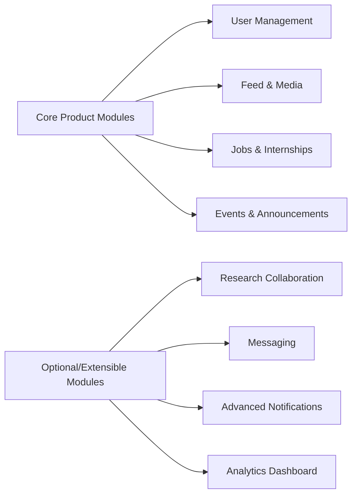
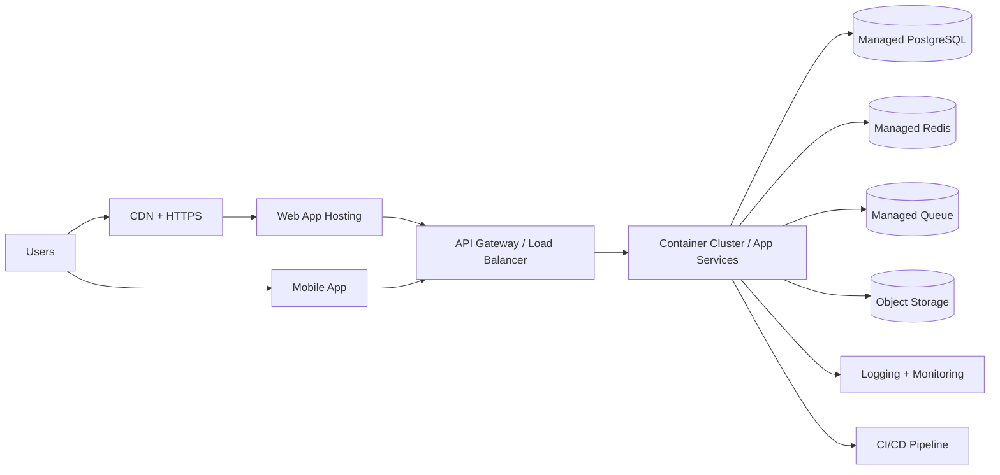

# Architecture Diagrams

## 1) SOA Diagram (Service Interaction)

```mermaid
flowchart LR
    W[Web Client] --> G[API Gateway]
    M[Mobile Client] --> G

    G --> A[Auth & User Service]
    G --> F[Feed Service]
    G --> J[Jobs Service]
    G --> E[Events Service]
    G --> R[Research Service]
    G --> MSG[Messaging Service]
    G --> N[Notification Service]
    G --> AN[Analytics Service]

    F --> DB[(PostgreSQL)]
    J --> DB
    E --> DB
    R --> DB
    A --> DB
    MSG --> DB
    AN --> DB

    F --> MQ[(Message Broker)]
    J --> MQ
    E --> MQ
    R --> MQ
    MSG --> MQ

    MQ --> N
    MQ --> AN

    F --> S3[(Media Storage)]
    R --> S3
```

## 2) Enterprise Architecture Diagram

```mermaid
flowchart TD
    Student --> Web
    Student --> Mobile
    Alumni --> Web
    Alumni --> Mobile
    Admin --> AdminPortal[Admin Console]

    Web --> Platform[DECP Platform Services]
    Mobile --> Platform
    AdminPortal --> Platform

    Platform --> UserDomain[User & Identity]
    Platform --> CommunityDomain[Feed + Messaging]
    Platform --> CareerDomain[Jobs + Applications]
    Platform --> EventDomain[Events + RSVPs]
    Platform --> ResearchDomain[Research Collaboration]
    Platform --> IntelligenceDomain[Analytics + Insights]
```

## 3) Product Modularity Diagram

```mermaid
flowchart LR
    Core[Core Product Modules]
    Optional[Optional/Extensible Modules]

    Core --> UM[User Management]
    Core --> Feed[Feed & Media]
    Core --> Jobs[Jobs & Internships]
    Core --> Events[Events & Announcements]

    Optional --> Research[Research Collaboration]
    Optional --> Msg[Messaging]
    Optional --> Notify[Advanced Notifications]
    Optional --> Dash[Analytics Dashboard]
```

## 4) Deployment Diagram (Cloud)

```mermaid
flowchart LR
    U[Users] --> CDN[CDN + HTTPS]
    CDN --> FE[Web App Hosting]
    U --> MB[Mobile App]

    FE --> GW[API Gateway / Load Balancer]
    MB --> GW

    GW --> K8S[Container Cluster / App Services]
    K8S --> RDS[(Managed PostgreSQL)]
    K8S --> REDIS[(Managed Redis)]
    K8S --> MQ[(Managed Queue)]
    K8S --> OBJ[(Object Storage)]

    K8S --> LOG[Logging + Monitoring]
    K8S --> CI[CI/CD Pipeline]
```
